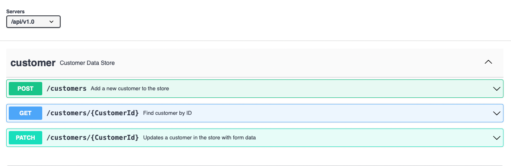

Customer Datastore




Download cockroach
```shell
curl https://binaries.cockroachdb.com/cockroach-v20.2.8.darwin-10.9-amd64.tgz | tar -xJ
cp -i cockroach-v20.2.8.darwin-10.9-amd64/cockroach /usr/local/bin/
```

[How to start cockroach db](https://www.cockroachlabs.com/docs/stable/start-a-local-cluster.html)

```shell
cockroach start \
--insecure \
--store=node1 \
--listen-addr=localhost:26257 \
--http-addr=localhost:9080 \
--join=localhost:26257,localhost:26258,localhost:26259 \
--background

```

init db

```shell
cockroach init --insecure --host=localhost:26257

```

see startup details

```shell
grep 'node starting' node1/logs/cockroach.log -A 11

```
ouput

```shell
CockroachDB node starting at 
build:               CCL v22.1.2 @ 2022-06-22 00:00:00 (go1.17) (go1.12.6)
webui:               http://localhost:8080
sql:                 postgresql://root@localhost:26257?sslmode=disable
RPC client flags:    cockroach <client cmd> --host=localhost:26257 --insecure
logs:                /Users/<username>/node1/logs
temp dir:            /Users/<username>/node1/cockroach-temp242232154
external I/O path:   /Users/<username>/node1/extern
store[0]:            path=/Users/<username>/node1
status:              initialized new cluster
clusterID:           8a681a16-9623-4fc1-a537-77e9255daafd
nodeID:              1
```

install db
https://www.cockroachlabs.com/docs/v22.1/movr.html